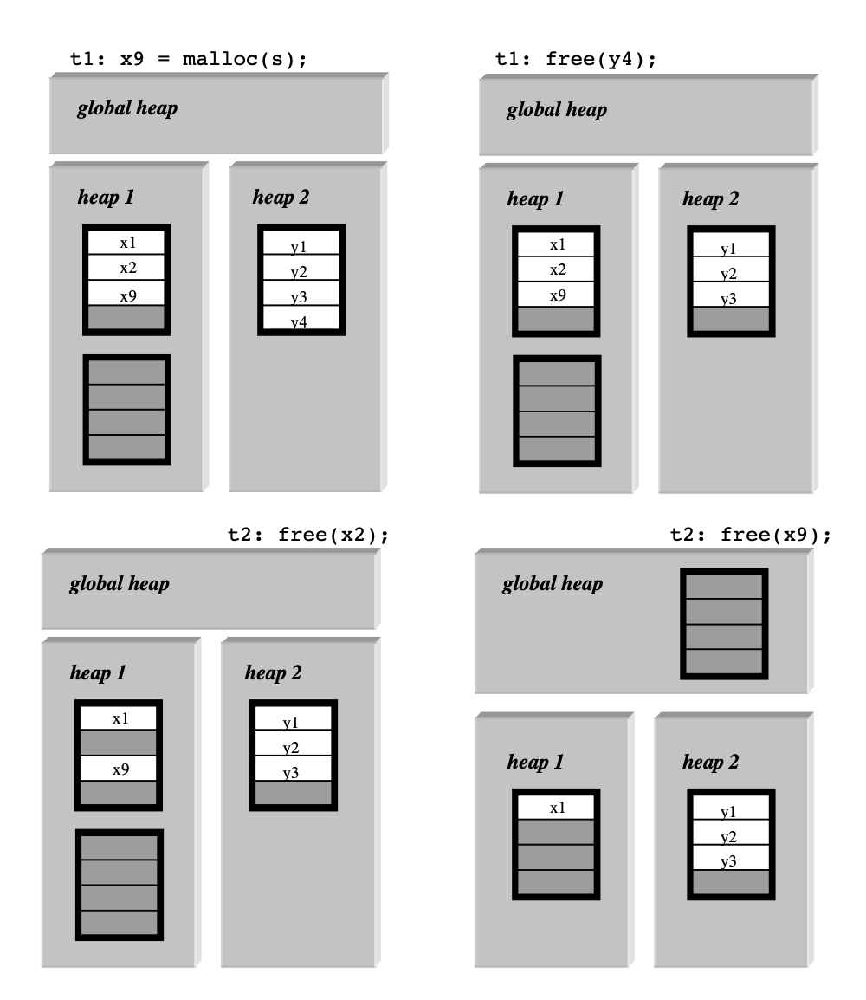

---

### Full bibliographic citation for research paper 
 Berger, Emery, Kathryn McKinley, et al. “Hoard: A Scalable Memory Allocator for Multithreaded Applications (PDF).” Proceedings of the 9th International Conference on Architectural Support for Programming Languages and Operating Systems (2000): 117–128.

---
### Description

The following is a short summary of the above mentioned paper in a blogpost format. The discussion is restricted to how the archtecture of the Hoard memory allocator mitigates common pitfalls of previous multithreaded memory allocators. The memory management algorithms as well as the experimental results regarding the same have been skipped. The curious reader may take a look at them in the original paper. 

Note: All images and mathematical formulae / notations have been taken from the original paper.

---

## 1. Introduction

Parallel programs are here to stay, with applications ranging from servers, scientific computing, video games to the training and inference of AI models. These are often implemented in C/C++ and high performance is imperative. A performance bottleneck that has been observed is that of memory allocation. The applications listed above make use of dynamic memory allocation. Futhermore, the bottleneck can be understood in terms of the following four desirable requirements from a multithreaded memory allocator:-

   1. Speed: The speed of malloc() and free() on a multithreaded allocator should be as close as possible to that of a serial allocator. When running the multithreaded allocator on a single core such a feature buys us good performance.
   2. Scalability: The performance of ou multithreaded allocator must scale linearly with number of processors the program is running on.
   3. Avoiding False Sharing: Threads on different processors should not be accessing data on the same cache line. This impacts the performance severely.
   4. Minimizing Fragmentation: The paper defines fragementation as the ratio (A / U) , where A is the total memory allocated from the operating system and U is the total memory allocated (actually used) by the program. High fragmentation is undesirable as it leads unavailability of usable blocks during the runtime of the program and hence causes paging.

With these desirable features discussed, we shall now proceed to discuss the motivation for the Hoard memory allocator. The paper concentrates on two main factors that motivated the design and guided the implementation of the Hoard allocator, namely blowup and false sharing. While false sharing has been introduced above, we shall discuss blowup in detail in the following section.

## 2. Motivation

Focus is kept on the two issues of blowup and false sharing as discussed above, and we discuss them one by one.

   1. Blowup:- Blowup is defined as the ratio of the maximum amount of memory allocated by a given allocator to the memory allocated by an ideal single processor allocator. While Hoard keeps the blowup bounded to a constant factor, the blowup has been either unbounded (in the case of Cilk) or scale with the number of processors (in the case of Ptmalloc). Now how may blowup arise? Take the case of a producer-consumer pattern in a program, where one thread is responsible for allocation and another is responsible for deallocation. Although the paper does not define the heap organization in such a scenario, assuming that the threads have a local heap, the blowup is unbounded. 
   Take another scenario, where a multithreaded allocator runs on P processors. In a scenario where the program constantly mallocs and frees a mem block of constant size X bytes, again assuming local heaps, the blowup is P.X / X = P. This is because on a serial implementation the maximum memory allocated by the program would have been X bytes.
   2. False Sharing:-  To put it simply, imagine a scenario where two fields of a struct (A and B) reside on the same cache line. The system has two cores with 1 thread per core (thrd id's #1 and #2). Now the fields A and B are on the same cache line of both the processors. Thrd #1 modifies A and does not modify B. Thrd #2 is responsible for modifying B. The cache coherence protocol will now modify the data in cache of processor #2 and reload it. This is known as false sharing and is a big cause for performance slowdown in multithreaded applications.   Padding memory blocks in order put each object into its own cache line shall cause a great increase in memory consumption and is hence unfeasible.

With the above pain points in mind, we can now proceed to discuss the architecture of the Hoard allocator.

## 3. The Hoard Allocator

We shall start by delineating the salient features of the allocator, which can later be expanded upon as and when necessary:-

* Hoard has one local heap for each processor and in addition has a global heap. 
* Maintains usage statistics for each of its heaps:-
    - ui - amount of memory in use in heap i
    - ai - amount of memory requested from the OS that is currently held in heap i
* Memory is allocated in chunks known as **superblocks**. Superblocks are arrays of blocks that can be allocated. The superblock also organizes its free blocks as a free list with a LIFO policy.
* The size of the superblock (S) is a multiple of the page size. Objects larger than S/2 bytes are managed directly via system calls (mmap() and munmap()).

Now let us see how the bounding of the blowup is acheived

### 3.1 Bounding Blowup

 * Every heap has ownership of its superblocks. If all the superblocks on a thread's heap are out of available memory, a new superblock is obtained from the global heap. If the global heap is unable to meet this demand then a new superblock is created by requesting virtual memory from the OS and is added to the thread's heap.
 * Empty superblocks are not returned to OS, instead are recycled for reuse. When a superblock crosses an **emptiness threshold** (measured by an emptiness fraction f) and K number of superblocks worth of free memory exists on the local heap, then a superblock that crosses the emptiness threshhold is taken off the local heap and added to the global heap. By doing so the following invariant is maintained:- 
    - (ui >= ai - K.S) && (ui >= (1 - f)ai)  
* The invariant above bounds the blowup to a constant factor(more on that later).
  
### 3.2 Example Demo

* Take a look at the image above. The image reads from top left to top right. Assume two threads. Emptiness fraction is f = 1/4 and K is 0.
* Initially, thread 1 has two superblocks (one 3/4 full and one empty) and thread 2 has a full superblock. 
* Thread 1 has allocated x9 from heap 1, for which the fullest superblock is chosen. (see top left diagram).
*  Now thread 1 frees y4 from heap 2. Emptiness is 3/4, which is more than 1/4 and a superblock is not "released" from the heap. (see top right).
*  Thread 2 now frees x2 from heap 1. Emptiness is 1/2, which is still greater than 1/4 and no superblock is released. (bottom left)
*  Thread 2 now frees x9. Emptiness is 1/4 (== f) and hence the completely free superblock from heap 1 is moved to the global heap (bottom right).
  
### 3.3 Avoiding False Sharing

* Only a single thread can allocate from a superblock at a time, as the superblock is a part of the local heap that is exclusive to a thread.
* Simultaneous memory requests from multiple threads are guaranteed to be serviced by different superblocks. This avoids active false sharing.
* Since freed blocks are also placed back exclusively in their superblock of origin, this prevents passive false sharing (by not giving future malloc requests the chance to distribute adjacent / nearby address blocks across multiple processors)
* **A Problem**: The above strategy can reduce false sharing, it does not entirely eliminate it. Since superblocks are moved from one heap to another (via the global heap), it could be that two heaps share cache lines. But since the released superblocks are atleast f empty and superblock transfer is an infrequent event, the chances of false sharing arising are greatly reduced. 

## 4. Analytical Results

Now we shall go through some proofs that establish bounds on blowup and synchronization. In order to do so some useful notation has been described:-

   - The heaps are numbered from 0 to P, with 0 being the global heap and 1 through P being the per processor heaps.
   - Capital letters are for the maxima and small letters are for current values
   - A(t) - Maximum amount of memory allocated by OS.
   - U(t) - Maximum amount of memory in use by program.
   - a(t) - Current amount of memory allocated by OS.
   - u(t) - Current amount of memory in use by program.
   - val(t) is the value of a variable after mem op t.
     (Below is some abridged notation, to suit our render format)  
   - i appended to a variable to denote the particular heap.
   - sum(val) to denote the summation of val across all heaps except global heap. 

### 4.1 Bounds On Blowup

#### Definition 1 : blowup = O (A(t) / U(t))

To show that the blowup of the Hoard allocator is bounded by a constant factor, we must first prove the following theorem:-

#### Theorem 1: A(t) = O(U(t) + P)

In order to prove theorem 1 , we need to make use of the following lemma:-

#### Lemma 1: The maximum amount of memory in the global heap and per-processor heaps is the same as the summation of maximum amount allocated to the per-processor heaps (proof included in a technical report provided by paper authors) | A(t) = sum(A(t))

#### Proof of Theorem 1:

* Recall our invariant from Section 3 that is maintained for each per-processor heap, i.e., (ai(t) - K.S <= ui(t)) && ((1-f)ai(t) < ui(t)). Only when a superblock crosses an **emptiness threshold** (measured by an emptiness fraction f) and K number of superblocks worth of free memory exists on the local heap, then a superblock that crosses the emptiness threshhold is taken off the local heap and added to the global heap.

* summing the maximum allocated memory from the OS per-processor heap gives us
  - sum(A(t)) <= SUMMATION(1 to P){ui(t)} + P.K.S
  - sum(A(t)) <= sum(U(t)) + P.K.S        (b/c sum(U(t)) = SUMMATION(1 to P){ui(t)})
  - sum(A(t)) <= U(t) + P.K.S             (b/c sum(U(t)) <= U(t))

Now from Lemma 1 we know that A(t) = sum(A(t)) hence

* A(t) <= U(t) + P.K.S 
* We can write the above as A(t) = O(U(t) + P)                       
* Now recall the definition of blowup, i.e., blowup = O (A(t) / U(t))
* We can write the above in terms of blowup, i.e. , blowup = O((U(t) + P) / / U(t)) 
* Assuming P << U(t), blowup = O(1)

### 4.2 Bounds on Synchronization

Synchronization costs arise in two ways:- Per Heap Contention and Global Heap Contention. 

#### 4.2.1. Per Heap Contention

The per heap contention is expected to be quite low.  Why?  
Consider the case where one thread is responsible allocating a block and multiple threads free it. If the amount to work done by the program with the block between allocating and freeing the block is so low that heap contention becomes an issue, the authors of the paper argue that the program itself is unscalable. The ideal allocator with completely independent heap access would acheive a speedup of 2x, irrespective of the number of processors. 
The authors of the paper are concerned with building a scalable allocator for scalable applications, an attempt has been made to bound the worst case for such application scenarios, which the authors argue would arise in a producer-consumer problem. In a heap contended producer-consumer scenario the malloc() and free() would become serialized. The slowdown would be twofold. But this slowdown would be ATMOST twofold, even as the application scales. 
The authors argue that in most multithreaded applications the allocator threads almost exclusively use the allocated memory and very little of that memory is freed by other threads, the per heap contention should be low.

#### 4.2.2. Global Heap Contention

Consider two cases - when a per-processor heap is growing and when it is shrinking.

* Growing Phase
  * In the growing phase blocks of memory are being malloced from a local heap. In this scenario a thread can acquire the global heap lock at most k / (f * S/s) times, where k is the number of ops, f is the emptiness fraction, S is the size of superblock and s is the malloc size. When a new superblock is acquired by the local thread, it has f * S/s blocks free. Assuming a single malloc exhausts the heap, the maximum number of times that k operations would access the global heap would be k / (f * S/s).
  * Thus the authors argue that in a growing phase the wort case is inversely propotional to the superblock size and is not unbounded.
* Shrinking Phase
  * In the shrinking phase, threads call repeated frees on blocks belonging to their respective local heaps. In the worst case, each free should make a superblock cross their emptiness thresholds, which would release them to the global heap, thus contending for a lock.
  * Additionally each block freed that belongs to a heap now held by the global heap would again result in a contention for the global heap.
  * The authors argue that creating such a scenario would require the execution of a highly improbable sequence of operations, and hence the global heap contention in such a shrinking phase would be unlikely.
  